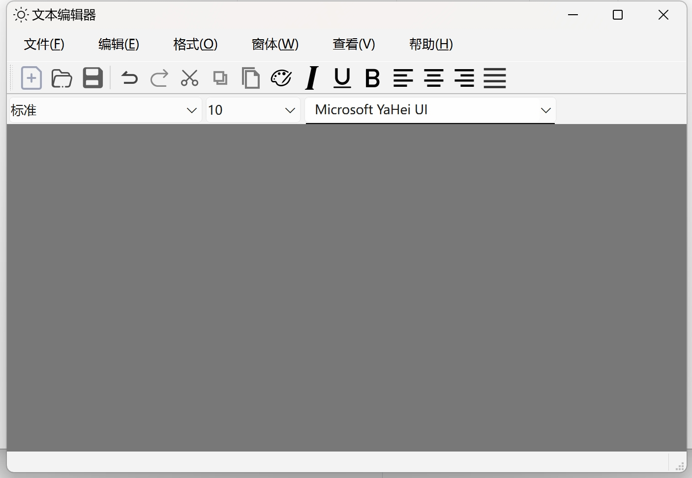
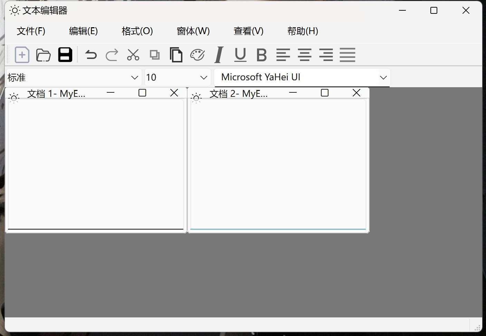
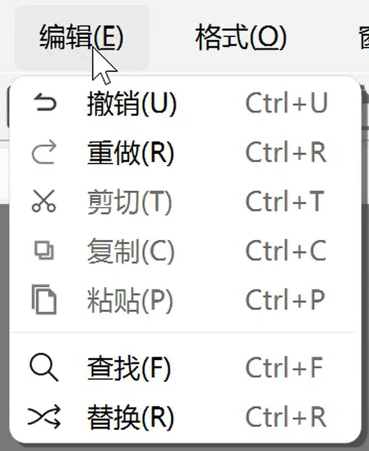
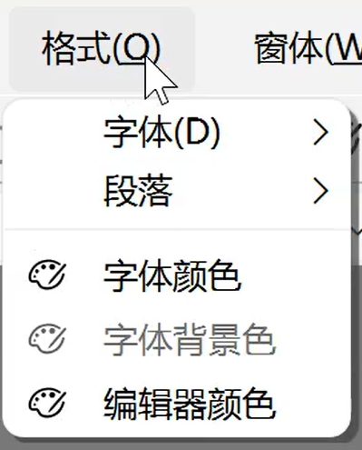
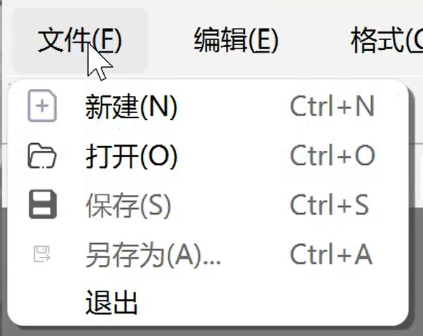
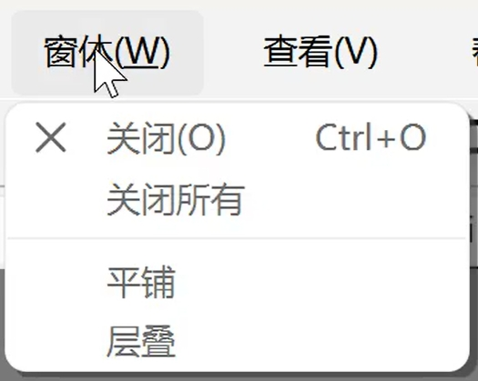
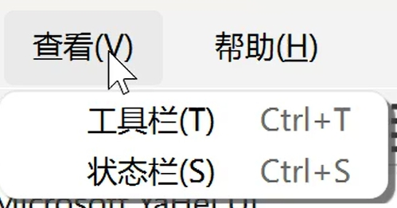
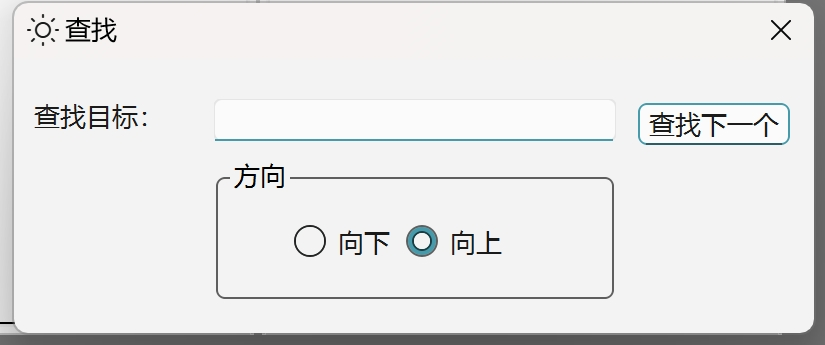
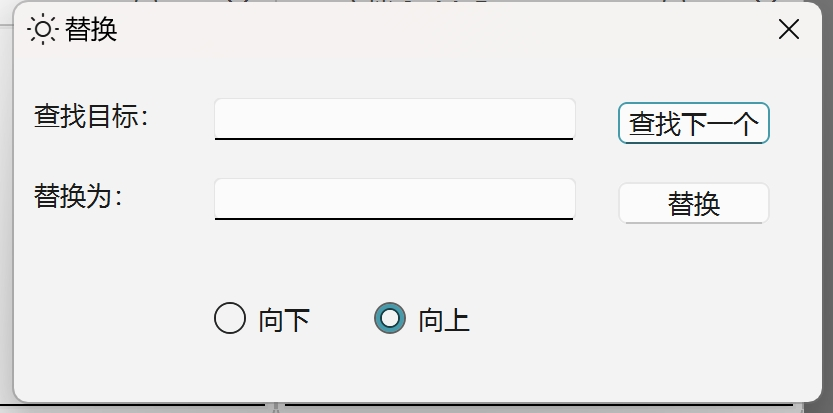

# QtEditor功能简述
#### 一个可以多窗口编辑的文本编辑器，支持了基本的记事本的作用

* 新建、保存
* 文本编写
* 复制粘贴
* 撤回重写

#### 也其中支持一些样式更改

* 字体颜色大小
* 窗口或编辑器背景色选择
* 对齐方式

#### 与记事本不同的是，我新增了查找和替换文本工具

* 在窗口中查找对应字段
* 对查找的固定字段进行文本替换

# 一些界面功能页面展示
### 主页面

### 多窗口

### 工具栏

### 查找与替换

# 基本功能演示

# 问题反馈
在使用中有任何问题，欢迎反馈给我，可以用以下联系方式跟我交流

* 名字：Moran
* 邮箱：guomengran3@gmail.com

# 感激
感谢以下的项目给我提供参考

* [https://github.com/Outlier9/CatEditor.git](https://github.com/Outlier9/CatEditor.git)
